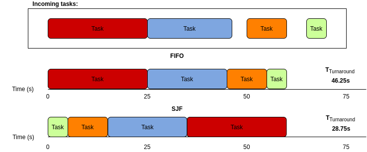
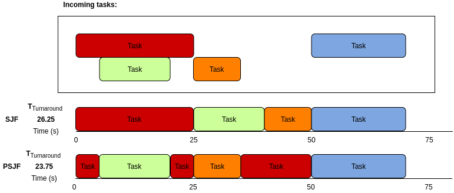
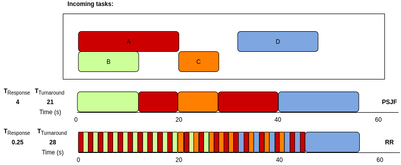
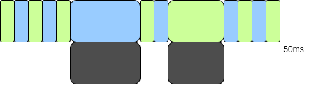

#### Chapter 7 Notes:
##### Overview:
* _Scheduling_ is not unique to computer systems, the concept stems from production process concepts which spawned various problems and associated algorithmic solutions.
* _Scheduling policies / disciplines_ are determined by analysing the _workload_ a system is required to performed (in this case, this is the number of processes running and their expected usages) - each process can be discussed independently as a _job_. The requirement for scheduling disciplines stems from the uncertainty of job runtime and priority. In a perfect world, all jobs would be equally important, all jobs would run for the exact same amount of time, and each job would perform no blocking (e.g. I/O access) and would run until completion. 
* Modern operating systems, in contrast to batch computing systems of yesteryears, are _preemptive_, allowing it to do all of the actions detailed in previous notes (e.g. stop a task and switch to another). In preemptive systems, a task does _not_ have to run til completion for another to begin, this should be fairly obvious.
* Scheduling disciplines have a metric, or measurement of success. _Turnaround_ is equal to the time at which a job is complete subtracting the time at which the job arrived to be run. A comparable metric would be a lower-level instruction scheduling/processing metric such as _throughput_ (the number of clock cycles an instruction spends being executed, see: [1]). The metric of _turnaround_ (a performance-based metric) is not necessarily the only metric that can be used to measure scheduling efficency, others include _Jain's Fairness Index_ (a more relevant metric for networks) [2] and scalability. Generally, _fairness_ is the antithesis of _performance_ (e.g. turnaround time) due to scheduling having to single-out certain processes that may _bottleneck_ overall performance.
* One of the most important metrics for modern systems is _response time_ which is determined by the first scheduled run minus the arrival time of the job (Tresponse = Tfirstrun - Tarrival).

* Each algorithm covered in chapter 7 is detailed below, further reading is recommended [4].

##### FIFO (1st -> 1st <-):
* Also called FCFS (first-come-first-served) - albeit very rarely in the software world. 
* Simple to implement and works well for a stream of jobs with low latency (that is, very little time between job arrival) and reasonably similar job completion times (e.g. three jobs: A, B, and C, Tarrival = 0, with an completion time of 10 seconds a piece would be the _perfect_ input jobs for a FIFO system).
* For the above example, a total _turnaround time_ of 60 seconds is expected (keep in mind the actual time to run the three jobs is 30 seconds - 10 seconds each) with an average turnaround of 20 seconds, as Tturnaround is equal to Tcompletion (e.g. for job B this is 20s) minus Tarrival [(10+20+30)/3].
* FIFO only works in these kinds of examples (small tasks with quick completion rates), once a single process starts to take up more completion time (e.g. imagine process A now takes 100 seconds instead of 10), the pipeline of tasks starts to get congested because the longest task is dealt with first - if you're wondering, Tturnaround = 110s (avg.) [(100+110+120)/3].

##### SJF (Shortest Job 1st):
* Shortest job first is a scheduling method that attempts to remove the _convoy effect_, in which multiple short tasks (low resource consumers - e.g. tasks with a fast completion rate) are scheduled behind a higher resource consumer (long running task) - the idea of SJF is adapted from the _waiting line problem_ (see: [3]).
* When compared to FIFO, SJF performs better in almost every case (obviously this doesn't always apply to the real-world due to the time and overhead taken to queue each task correctly, sometimes FIFO is the better choice in this regard - such as when the Tturnaround for FIFO and SJF are almost equal). An example is given below of when SJF provides a better _turnaround_ than FIFO. 

* This example, however, assumes that all jobs are arriving at the same time and need to be sorted into an order which provides the quickest avg. turnaround (a good scenario for SJF). This is _not_
how jobs arrive in the real world. Latency is expected, that is, a group of jobs will be displaced, arriving at different points in time. 
* When using SJF with job latency, FIFO-esque scheduling occurs if longer jobs arrive just before shorter jobs.

##### Shortest Time-to-Completion First (STCF):

* As noted previously, preemptive modern operating system schedulers do not care if a process is finished running or not when it decides to switch to another. This allows for STCF scheduling - where jobs can be part-run in order to switch to a new task that can be completed in less time. This is why STCF is sometimes called PSJF (preemptive shortest-job-first). 
* The example below shows how preempting a job before switching to another can improve Tturnaround.

* STCF/PSJF works for simplistic systems with little user-interaction, however, users expect running processes to be scheduled when they ask for them to be scheduled (e.g. a program is run). This doesn't fit with the mantra of STCF - if multiple jobs arrive at the same time, but many of them are shorter/lower resource than the program the user ran, there will be a considerable lag between the arrival of the task and its first schedule/run. This is a metric called _response time_.

##### Round robin:
* _RR_ (round robin) - also called _time slicing_ - is a scheduling algorithm that favours response time over minimum turnaround time. Jobs are handled differently than the previous algorithms, running each job partially (in a _slice_ called a _scheduling quantum_) before switching to the next job in the queue, repeating this process until each job is finished.
* The time period that the partial job (_slice_) runs for is determined by the timer-interrupt period discussed in the previous chapter where the run period of the slice must be a multiple of this timer-interrupt period (e.g. a timer-interrupt period of 5ms would allow slices of 5ms, 10ms, 15ms, etc...).
* Determining this run period is a balancing act, make the window too short and context switching becomes a costly part of the entire job run, make the window too long and response time is reduced. Determining this value and the associated trade-off is the act of _amortizing_ the cost of the round-robin scheduler (e.g. reducing the number of slices required to complete a task reduces the total _wasted_ time spent context switching. Note that the actual context switch is not what causes this, given the timed example from last chapter - rather saving, clearing, and restoring CPU caches and on-chip hardware is what consitutes the majority of this wasted time).
* Round-robin variants such as QFQ+ (Quick-Fair-Queuing-Plus) and CFS (Completely Fair Scheduler) use round robin on-top of a system to split processing time among processes (_fairness_) which, as seen below (normal _RR_ versus previously discussed _PSJF/STCF_) produces _worse_ turnaround times (avg.) than any other scheduling method discussed. As is core with scheduling algorithms, trade-offs are made; Turnaround is sacrificed for response time, and subsequently response time is sacrificed for fairness which in turn actually improves turnaround time.  

##### Scheduling with I/O:
* I/O is integral to any program but causes a problem that the operating system must solve during the scheduling routines: When a call for I/O is enacted, the current process (that which is accessing I/O, whether it be a slow call to disk or a faster call to a L3 cache) will be blocked. The scheduler can then move to another task, and return to the task when it becomes unblocked - if it is efficient to do so. This is shown in the example below where job _A_ (green) initiates an I/O (e.g. read from disk) call and becomes blocked. Whilst it is blocked, it may not run any additional instructions, so the OS swaps to process _B_ (blue) for that period of time (or longer) and returns to job _A_ when it is no longer blocked, restarting the round-robin process. This is _overlap_.

##### Feedback:

* One outstanding issue that has not been addressed is the idea that we can easily predict the job length of each incoming task, thus making it easy to sort and handle tasks in the ways described above. This, however, is not quite the truth - operating systems do not have prior knowledge of job length when a job is received, rather is uses prior information to inform the most likely outcome for subsequent jobs - a feedback system called a _multi-level feedback queue_. This is discussed in the next chapter (8).

... _You can't avere la botte piena e la moglie ubriaca._

#### Sources:

[1] Measuring instruction latency and throughput: https://software.intel.com/content/www/us/en/develop/articles/measuring-instruction-latency-and-throughput.html

[2] Beyond Jain's Fairness Index... by Ware et Al.: https://www.cs.cmu.edu/~rware/assets/pdf/ware-hotnets19.pdf

[3] Waiting Line Models: https://www.csus.edu/indiv/b/blakeh/mgmt/documents/opm101supplc.pdf

[4] A Review Study on the CPU Scheduling Algorithms: https://www.ijarcce.com/upload/2016/august-16/IJARCCE%205.pdf