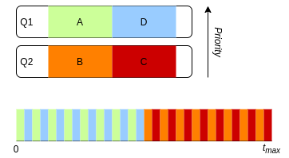
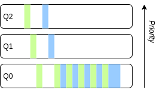
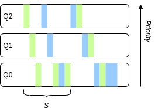
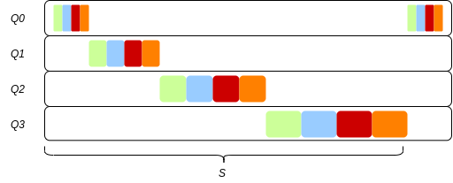

#### Chapter 8 Notes:
##### Summary:
* The _MLFQ_ (Multi-level feedback queue) is a common approach to scheduling developed in 1962 for the _Compatible Time-Sharing System_ and subsequent _Multics_ operating systems[1]. It was adapted and used on a variety of previous-generation operating systems such as Windows NT variants (e.g. XP) and Linux kernel prior to version 2.6 - after which Linux switched to a _fairness-based_ scheduler (Posch, 2017). 
* The primary solutions provided by _MLFQ_ are aimed at the problems of optimising job scheduling in such a way that decreases _Tturnaround_ time and provides adequately short _Tresponse_ times.
* It does this by assigning each job to a number of queues which are sorted by priority (descending), this can be defined as a general rule that _if priority(A) > priority(B), then A runs and B does not_. This expands into another rule that _if a queue has multiple jobs of equal priority (e.g. priority(A) == priority(B)), then both jobs are run using a round-robin discipline._

* The behaviour of a process, to a degree, dictates its priority (e.g. a process that requires data from user input often will incurr a higher priority as it is an interactive process - in a similar regard, a long-running high-intensity process may incurr a lower priority as it is a larger CPU-hog).
* Queues are _not_ static and re-prioritisiation of a job during its runtime is expected. A job will almost always be gifted a spot in the highest priority queue when it first appears, but its priority will change over its runtime dependent on its behaviour. To determine if a process is using the CPU intensively and does not require a great deal of interaction (and thus response time is not a factor), as a general rule, priority for that job is reduced (shifted down to the queue below) if the process does not relinquish the CPU over the course of a time-slice, if it does so (does not use an entire time-slice while running) it will stay at the same priority. _See: example below which demonstrates what happens when two long-running processes with minimal interaction arrive at different times._

* _MLFQ_ approximates _SJF_ by treating all jobs as if they were short-running priority jobs until they start to use up CPU time in a time-slice and are reduced, filtering long-running batch jobs from shorter, priority jobs.
* The example explained thusfar has an issue[2] where a steady stream of incoming jobs (or multiple interactive jobs) will starve the lower-priority queues of CPU time (it's not a _fair_ system).
* To solve the issue of starvation for certain low-priority tasks, after a period of _S_[3] all currently running jobs are removed from their current queue and put in the top-priority queue. This also effectively reduces the latter issue raised in [2] allowing each long-running process to _reset_ its behaviour (obviously this doesn't _completely_ fix the problem, e.g. a process is reset during a long-period of CPU usage without interactivity, as soon as its relegated to the lowest-priority queue it requires interactivity, there's now a gap between this period on the reset that will cause a substantial hit to response time). 

* This current system presents a security risk as a savvy programmer can create a program to use all but a fraction of its allotted time-slice and keep a CPU-heavy process in the highest priority queue, to stop this from occurring, the MLFQ monitors how much of each time-slice a process uses and demotes a process once it's used an allotted amount (whether its across multiple slices or in a single period). A trend emerges: All long-running processes eventually move towards the lowest-priority queue until a priority boost occurs - to facilitate this further, many implantations of MLFQ use different quantum periods/time slice durations for each queue[4]. The example below shows this premise using four long-running jobs.

##### Homework notes:

__Q2:__ Examples:

1. _Long running job over time:_ `prompt>./mlfq.py -l 0,200,0 -q 10 -B 0 -c`
2. _One long job, one short job:_ `prompt>./mlfq.py -l 0,200,0:100,20,0 -q 10, -B 0 -c`
3. _One I/O intensive, one CPU intensive job_: `prompt>./mlfq.py -l 0,200,0:50,15,1 -q 10 -B 0 -i 10 -c` (replacing or removing _-i_ value will change the interval, this just looked correct when comparing output to the graphed example).
4. _With and without boost:_ `prompt>./mlfq.py -l 0,100,0:100,100,5 -q 10 -B 0 -i 5 -c` (without)  
`prompt>./mlfq.py -l 0,100,0:100,100,5 -q 10 -B 50 -i 5 -c` (with)
5. _With and without gaming tolerance:_ `prompt>./mlfq.py -l 0,250,0:75,100,9 -q 10 -B 0 -i 1 -S -c` (without)
`prompt>./mlfq.py -l 0,250,0:75,100,9 -q 10 -B 0 -i 1 -c` (with)
6. _Lower priority, lower quanta:_ `prompt>./mlfq.py -l 0,140,0:0,140:0 -Q 10,20,40 -B 0 -c`

__Q3:__ Emulate Round-Robin: 

* Set the simulation program to use one queue for multiple tasks and set its quantum length to a static value, e.g. `prompt>./mlfq.py -l 0,140,0:0,140,0 -Q 1 -B 0 -c`

__Q4:__ Gaming the system:

* See example 5 above (without): `prompt>./mlfq.py -l 0,100,0:5,100,9 -q 10 -B 0 -i 1 -S -c`

__Q5:__ Answer: `50ms`

__Q6:__ In the provided python script (simulator) the -I flag forces the job completing its I/O to be run _first_ proceeding any job that was currently in progress (e.g. job B is running and starts an I/O call, blocking job B so job A will run. When job B is finished with its blocking call, job B will run if -I is set, job A will run if -I is not set.)
##### Footnotes:

[1]: The _Multics_ operating system (and with it, the influential _CTSS_) was technologically influential but also paved the way for the ITS (Incompatible Time-Sharing System) and UNIX, both of which were named as a tongue-in-cheek reference to the CTSS and Multics projects.

[2] Additional issues include the fact that a programmer can alter their program to have it constantly remain in the top-priority queue, as well as the fact that this system of prioritising based upon a job's initial behaviour is not realistic (a job may start out using a batch-style execution in which it hogs CPU time to load up resources, then becomes interactive, e.g. a video game).

[3] What value should _S_ be? Scheduling disciplines like MLFQ have a tendency to contain magic constants dependent on the implementer, for example: round-robin quantum periods range between systems and so does the 'level' of boost applied to a process - Windows used a value of 6 (levels of queues to orientate through) rather than another value and nobody really knows why. The truth is that developers of scheduling systems tend to arrive at _magic numbers_ like these through trial-and-error (Hailperin, 2006). In the case of _S_, a value needs to be arrived at that does not cause starvation (such as in the case without a boost) and not too short that interactive jobs are not prioritised over long-running jobs.

[4] Some operating system schedulers such as Solaris's TS (time-sharing) scheduler has configurable tables that allows administrators to edit the default parameters based-upon their needs. Other schedulers such as that implemented in OpenBSD tweaks parameters based-upon _decay-usage algorithms_ which decrease and increase (the priority of) jobs based upon their CPU usage which accumulates based upon usage (incremented by a value of 1 for each clock-tick used within a process) and decays periodically (in cycles) (Epema, 1995). Another feature highlighted in the _Epema_ implementation is the _p-nice_ value which relates to the _niceness_ value implemented in Unix systems (a utility is available in the command line called _nice_ which allows this value to be altered for a process, thus allowing it to run with a higher-priority). _Niceness_ is an inverse value - negative niceness process run at the top of the priority hierarchy, therefore potentially blocking other processes, hence the parameter's name.